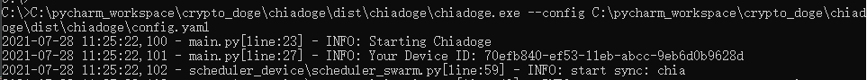

# ChiaDoge
ChiaDoge is a chia tools.It can manage your chia device.It supports a web dashboard that allows you to monitor your Chia farm and send notifications when something error in your Chia device. It can link multiple farmers/harvesters to your account.we support Chia/Flax/Chaingreen/Goji and so on.It means any kind of chia is ok

You can register and login the [web server](http://39.99.176.125:28080) with your Browser（recommend Chrome）：[http://39.99.176.125:28080](http://39.99.176.125:28080/)


# Pre-requisites

- Windows + Ubuntu
- [Python 3.7+](https://www.python.org/downloads/windows/)
- [Git](https://git-scm.com/downloads)
- Enabled `INFO` logs on your chia farmer

# Windows

## How to enable INFO logs on chia farmer?

First we'll set Chia's log level to `INFO`. This ensures that all logs necessary for `chiadoge` to operate are available
under `C:\Users\[YOUR-USER]\.chia\mainnet\log\debug.log`.

1. Open the file `C:\Users\[YOUR-USER]\.chia\mainnet\config\config.yaml` in your favorite text editor
2. Find the line that reads `log_level: DEBUG` (under the `farmer` section) and change this to `log_level: INFO`
3. Restart the GUI or run `chia start --restart farmer` from the command line


## Run `Chiadoge.exe`
1. Download [chiadoge.zip](https://github.com/chiadoge/chiadoge/releases) from Github
2. Open zip,you will find `chiadoge.exe` and `config.yaml`


3. Extracted the zip to a directory and enter to it
4. Run with: `chiadoge.exe --config config.yaml`
5. Then you will get a `Device ID`



6. [Register](http://39.99.176.125:28080) web monitor with email
7. Add node by `Device ID`


# Linux(Ubuntu)

## How to enable INFO logs on chia farmer?

**Reminder**: `INFO` level log in Chia must be enabled (`chia configure -log-level=INFO`)


## How to use Chiadoge
1. Download

```shell
git clone https://github.com/chiadoge/chiadoge.git
cd chiadoge
```

2. Run the install script.

```shell
chmod 777 install.sh
./install.sh
```

3. Open up `config_linux.yaml` in your editor and change some profiles to yourself


4. Run the start script
```shell
chmod 777 start.sh
./start.sh
```
5. You will get a `Device ID` 


6. [Register](http://39.99.176.125:28080) web monitor with email and  add node by `Device ID`


# Where is my Chia?
## Windows
```
chia exec file Default path is: C:\Users\<USERNAME>\AppData\Local\chia-blockchain\<VERSION>\resources\app.asar.unpacked\daemon\
debug.log Default path is: C:\Users\<USERNAME>\.chia\mainnet\log\debug.log
```

## Ubuntu
### Install Chia with deb file
```
chia exec file Default path is: /usr/lib/chia-blockchain/resources/app.asar.unpacked/daemon/
debug.log Default path is: /home/<USER>/.chia/mainnet/log/debug.log
```

### Run Chia with source code (It means you run chia in python venv by yourself)
```
chia exec file Default path is: <ProjectPath>/venv/bin/
debug.log Default path is: /home/<USER>/.chia/mainnet/log/debug.log
```